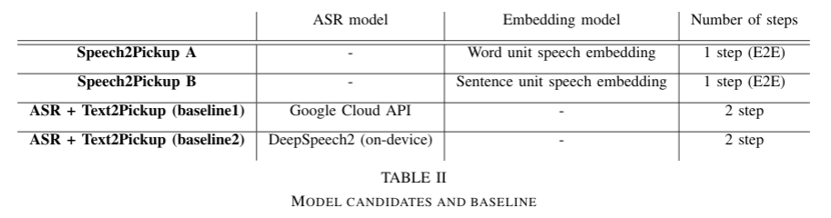
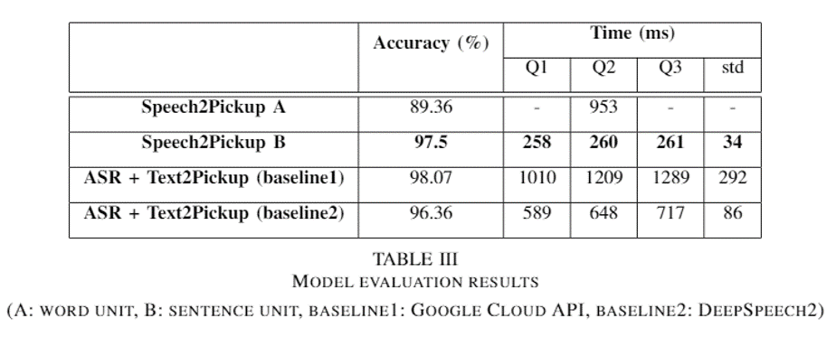
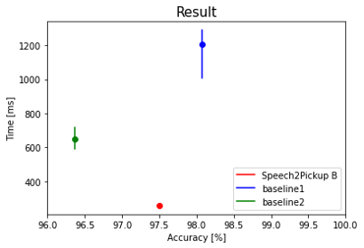

# Speech2Pickup
We propose Interactive Speech2Pickup Network for Speech based Human-Robot Collaboration. The proposed model takes speech from the person as input, and predicts the desired task specific output. We tested our model on Multi-object Detection task. 

Our proposed method could handle two problems compared to the baseline methods that use ASR(Automatic Speech Recognition) to transfer speech to text, and Text based model to transfer text to task specific output.
- Error accumulation due to seperated optimization.
- Time delay due to network based ASR system.
  
## Proposed model

  

## Dataset

  

## Experiment

  

## Result
### 1. Prediction accuracy & Time efficiency

  

  

### 2. Model prediction example

#### 1) Speech2Pickup (word unit embedding)

  

#### 2) Speech2Pickup (sentence unit embedding)

  

## Reference
[1] Hyemin Ahn, Sungjoon Choi, Nuri Kim, Geonho Cha, and Songhwai Oh. 2018. "Interactive Text2Pickup Networks for Natural Language-Based Human--Robot Collaboration." IEEE Robotics and Automation Letters 3, 4 (2018), 3308—3315.
https://arxiv.org/abs/1805.10799

[2] Y.-A. Chung and J. Glass, “Speech2Vec: A sequence-to-sequence framework for learning word embeddings from speech,” in Proc. Interspeech, 2018, pp. 811–815
https://arxiv.org/abs/1803.08976

[3] A. Haque, M. Guo, P. Verma, and L. Fei-Fei, “Audio-linguistic embeddings for spoken sentences,” in Proc. ICASSP, 2019.
https://arxiv.org/abs/1902.07817

[4] "Deep speech 2 : End-to-end speech recognition in English and Mandarin". In Proceedings of the 33rd International Conference on Machine Learning, Maria
Florina Balcan and Kilian Q. Weinberger (Eds.), Vol. 48. PMLR, New York, New York, 173–182. Retrieved from
http://proceedings.mlr.press/v48/amodei16.html.

[5] 'Interactive Text2Pickup Networks' implementation
https://github.com/hiddenmaze/InteractivePickup
